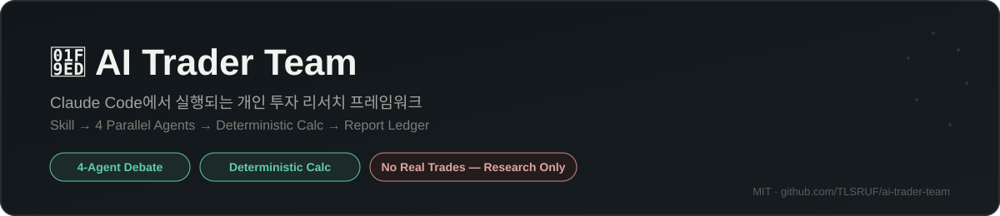
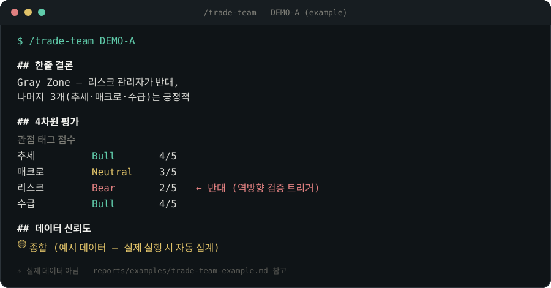

<p align="center"></p>

# AI Trader Team

[](https://github.com/TLSRUF/ai-trader-team/actions/workflows/test.yml)
[](../../../LICENSE)
[](../../../requirements.txt)
[](../../../skills/)
[](../../../agents/)

<p align="center">
  <a href="../../../README.md">한국어</a> ·
  <a href="../../../README_EN.md">English</a> ·
  中文
</p>

一个让个人也能拥有专业级投资研究团队的框架，基于 AI 智能体构建。由斜杠命令（Skill）→ 并行子智能体（不同视角的人格）→ 确定性验证工具，三层结构组成。

> ⚠️ 仅供教育与研究用途，不构成投资建议。最终判断与责任始终由用户自行承担。

## 预览

运行 `/trade-team` 时，4 个视角的智能体会并行展开辩论，团队负责人不做折中，直接综合结论：

<p align="center"></p>

*(示例数据 —— 摘自 [reports/examples/trade-team-example.md](../../../reports/examples/trade-team-example.md)，请勿用于实际投资决策。)* 想直接看交互过程本身？请查看 **[运作原理页面](https://tlsruf.github.io/ai-trader-team/)**（한국어/English/中文）。

## 适合谁使用

- **波段交易者** —— 用 `/screen` 快速筛选候选标的，再用 `/trade-team` 在进场前获得 4 视角（趋势·宏观·风险·资金面）交叉验证
- **长期持有者** —— 用 `/position-review` 定期复查持仓最初的进场依据是否依然成立
- **策略验证者** —— 不依赖主观判断，而是用 `tools/backtest.py` 的 walk-forward 验证来确认规则化策略是否过拟合
- **Claude Code 用户** —— 已经熟悉 Claude Code 工作流，想参考一个结合 Skill / 子智能体 / 确定性工具的框架设计

## 架构

```
Skill Layer   (skills/)   ← 按场景划分的入口
     ↓                        ↑
Agent Layer   (agents/)   ← 按视角划分的并行子智能体
     ↓                        ↑
Tool Layer    (tools/)    ← 精确计算 · 数据校验
     ↓                        ↑
Report Layer  (reports/)  ← 台账/产出物，状态被下一次执行重新读取
```

更详细的分层说明请参阅 [docs/architecture.md](../../architecture.md)。

> `reports/` 不是只写入的日志，而是**不让任何判断脱离依据的台账** —— 每份报告都完整保留 4 个视角的评分、依据与反证，下一次执行会重新读取这些状态。

## 安装

```bash
git clone https://github.com/TLSRUF/ai-trader-team.git
cd ai-trader-team
pip install -r requirements.txt   # 实时/历史行情查询（market_data.py）需要
./scripts/install-claude-commands.sh
```

在 Claude Code 中打开本仓库后，即可直接使用 `/screen`、`/trade-team`、`/position-review`、`/portfolio`、`/post-mortem` 斜杠命令。

```
/screen AAA BBB CCC     # 用低成本筛选先过滤候选
/screen                 # 不带参数时，筛选 reports/watchlist.md 全部内容
/trade-team AAA         # 仅对通过筛选的标的进行 4-agent 深度分析
/position-review AAA    # 进场后定期复查最初的论点是否依然成立
/portfolio              # 全部持仓的实时行情·未实现盈亏仪表盘
/post-mortem AAA        # 平仓后复盘已实现盈亏（R 倍数）与判断归因
```

**推荐流程**：先用 `/screen` 筛选候选 → 仅对通过筛选的标的用 `/trade-team` 深度分析并做出进场判断 → 进场后用 `/position-review` 定期检查论点漂移，并用 `/portfolio` 查看实时盈亏 → 平仓后用 `/post-mortem` 复盘。持仓与关注列表分别记录在 `reports/positions.md`、`reports/watchlist.md` 的台账中，下次执行时会自动读取。

## 回测（`tools/backtest.py`）

与上述 4-agent 定性判断（各 Skill）分开，这是把本项目已有的确定性规则单独抽出来、用历史数据验证的工具。**它不重现 LLM 的定性判断** —— 因为每个时间点的新闻与背景无法还原到过去。它验证的是「均线上穿突破 + 固定比例止损 + 固定盈亏比目标价」这一近似策略，在不同资产类别、不同周期下的稳健性。

```bash
# 简单运行 —— 计入摩擦成本（手续费+滑点近似）
python tools/backtest.py run --tickers '["AAPL","MSFT","NVDA"]' \
    --start 2023-01-01 --end 2026-08-01 --friction-pct 0.1

# 计入同时持仓的资金约束（组合风险敞口上限）
python tools/backtest.py run --tickers '["AAPL","MSFT","NVDA"]' \
    --start 2023-01-01 --end 2026-08-01 --max-heat-pct 6

# Walk-forward 验证 —— 仅在样本内区间选参数，
# 应用到从未见过的下一区间，确认是否过拟合
python tools/backtest.py walk-forward --tickers '["AAPL","MSFT","NVDA"]' \
    --start 2022-01-01 --end 2026-08-01 --window-months 12 --step-months 6
```

实际验证结果请参阅 `reports/2026-08-23-backtest-comparison.md`（美股大盘股参数调优）与
`reports/2026-08-23-backtest-crypto-extension.md`（加密货币扩展验证 —— 结论是同一策略
无法跨资产类别泛化）。

### 年度表现（对比 S&P500）

10 支标的（AAPL·MSFT·NVDA·GOOGL·AMZN·META·TSLA·JPM·UNH·XOM）构成的样本池，使用调优后的
默认参数，计入 0.1% 摩擦成本的结果。方法论与局限性请务必一并阅读
`reports/2026-08-26-performance-vs-sp500.md` —— 这是历史回测表现，不保证未来收益。

| 年份 | AI Trader Team（调优回测） | S&P500（买入并持有） |
|---|---|---|
| 2022 | **-10.67%** | -19.95% |
| 2023 | **+96.86%** | +24.73% |
| 2024 | **+94.94%** | +24.01% |
| 2025 | **+54.92%** | +16.65% |

即使在 2022 年的熊市中，回撤也只有指数跌幅的一半左右，其余 3 个年度均大幅跑赢 S&P500。
详细方法论、数据来源与局限性请参阅 `reports/2026-08-26-performance-vs-sp500.md`。

## 示例输出

`/trade-team` 会并行运行 4 个视角的子智能体，并像下面这样综合成一份报告（以下是从
[reports/examples/trade-team-example.md](../../../reports/examples/trade-team-example.md)
摘录的示例数据 —— 请勿用于实际投资决策）：

| 视角 | 标签 | 评分 | 关键依据 |
|---|---|---|---|
| 趋势 | Bull | 4/5 | 多周期均线呈多头排列，放量突破确认 |
| 宏观 | Neutral | 3/5 | 流动性环境偏友好，但板块轮动方向存在矛盾 |
| 风险 | Bear | 2/5 | 近期类似行情下最大回撤较大，且已持有高相关性仓位 |
| 资金面 | Bull | 4/5 | 净买入资金与异常成交量确认，期权持仓中性 |

> **一句话结论**：4 个视角中有 3 个（趋势·宏观·资金面）偏正面，但风险经理基于亏损情景提出反对，判定为 **Gray Zone** —— 需要判断是缩小仓位介入，还是等风险信号解除后再说。

这种意见分歧（Gray Zone）不是缺陷，而是设计初衷 —— 4 个 agent 回答的是不同的问题（价格会涨吗？vs 在这个账户背景下能承受这笔亏损吗？），分歧是自然结果，最终判断始终留给用户。其余 Skill 的实际输出示例可在 [reports/examples/](../../../reports/examples/) 中全部查看。

## 目录结构

| 目录 | 作用 |
|---|---|
| `skills/` | 斜杠命令定义（canonical source） |
| `agents/` | 按视角划分的 agent 人格定义 |
| `tools/` | 确定性计算/校验脚本 |
| `reports/` | 执行结果报告、持仓/关注列表台账 |
| `scripts/` | 安装·同步脚本 |
| `docs/` | 设计文档 |
| `tests/` | `tools/`、`scripts/` 脚本的测试 |

## 贡献

所有工作始终遵循 **Issue → 主题分支 → PR** 的顺序。详细规则请参阅 [CONTRIBUTING.md](../../../CONTRIBUTING.md)。

## 许可证

[MIT](../../../LICENSE)

## 参考

三层架构参考了 [xbtlin/ai-berkshire](https://github.com/xbtlin/ai-berkshire) 的设计。
